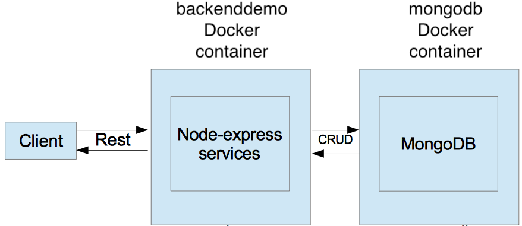
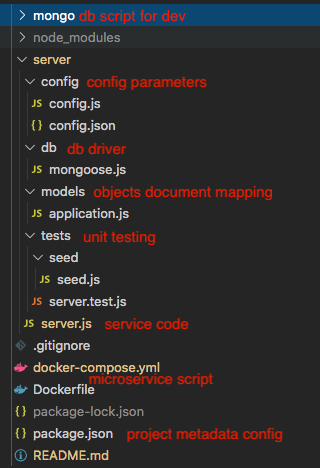

# Simple Back-end App
Simple back-end app implemented using Node.js, tested on OSX and can be deployed using docker-compose.


## Back-end Architecture



The node app is dockerized in an image called backenddemo. The database docker image is called mongodb. Once started, backen container will connect to mongodb. Everything receiving requests from client, the backenddemo will communicate with database container to save/load application data.

## How to run
<!-- Please make sure you have [git](https://www.atlassian.com/git/tutorials/install-git), [Docker](https://docs.docker.com/docker-for-mac/install/) and [docker-compose](https://docs.docker.com/compose/install/) on your machine.

Once you have those installed, open your terminal and follow:

```
git clone https://github.com/chanlevan/backend-demo.git
cd backend-demo
docker-compose up -d 
``` -->

Please make sure you have [Docker](https://docs.docker.com/docker-for-mac/install/) and [docker-compose](https://docs.docker.com/compose/install/) on your machine.

Once you have those installed, go to the unzip project folder, open your terminal and type:

```
docker-compose up -d 
``` 

Once finished the output will display
```
Creating backenddemo ... done
Creating mongodb ... done
```

At this point, the application is ready to use. [Postman](https://www.postman.com/downloads/) is recommended to play around.

Service URL: `http://localhost:3000`

Requests to the server are described as below.

## Requests
1. POST one or multiple applications to server

* Request: `POST /apps`
    Accept JSON request either as an object or an array of objects. Full name(`fullName` as id) is mandatory, while other attributes are optional

* Example

```
[{
	"fullName": "Vikram Le", 
	"dob": "07-05-1993",
	"profession": "engineer"
},
{
	"fullName": "Tony 2", 
	"dob": "07-05-1990",
	"profession": "student"
}
]
```

2. GET valid and invalid applications 

* Request: `GET /validity`

  Request valid and invalid applications from server. Valid applictions are considered to have full attributes: full name, date of birth(`dob`), profession(`profession`). On the other hands, any applications lack  of date of birth or profession are considered to be invalid 

3. GET failed applications
* Request: `GET /failedApps`

  Request failed applications from server. Failed applications are considered to have the risk score lower than 0.0

4. GET cumulative risk score of all applications
* Request `GET /accRisk`

  Request the sum risk score from all applications. 

## Project structure


## Unit testing

Current version supports automatic unit testing locally using `nodemon, mocha, expect and supertest`. Once you have install node.js, npm, you can open the project folder on the terminal and run:

```
npm install 
cd mongo
docker-compose up -d
npm run test
or
npm run test-watch
```

The second command executes the unit testing every time you type it, while the last one monitors code changes and runs the test automatically.